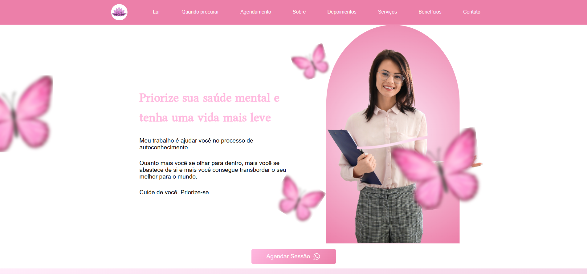

# Psicoterapia - Página de Agendamento e Consultas

**Link para o site**: [https://psicologa-puce.vercel.app/](https://psicologa-puce.vercel.app/)

### Print da Página:

  <!-- Substitua com o caminho correto da imagem -->

Este é um site criado para uma **psicóloga** fornecer informações sobre seus serviços, incluindo agendamento de sessões, FAQ, depoimentos, e mais. O projeto foi desenvolvido utilizando **React** e **Sass**, com várias bibliotecas para funcionalidade adicional.

## Funcionalidades

- **Agendamento de Sessões**: Permite que os usuários agendem uma consulta.
- **Carrossel de Depoimentos**: Exibe feedback de pacientes sobre o serviço oferecido.
- **FAQ**: Respostas para perguntas frequentes sobre psicoterapia e os serviços oferecidos.
- **Envio de E-mail**: O usuário pode enviar um e-mail diretamente da página de contato.
- **Navbar Responsiva**: Menu de navegação com um menu hambúrguer para dispositivos móveis.

## Tecnologias e Bibliotecas Utilizadas

- **React**: Framework JavaScript para construir interfaces de usuário.
- **Sass**: Pré-processador CSS para escrever estilos de forma modular e reutilizável.
- **React Router**: Biblioteca para navegação entre páginas (caso o projeto tenha mais de uma página).
- **React Carousel**: Biblioteca para implementar o carrossel de depoimentos.
- **EmailJS**: Serviço para enviar e-mails diretamente do cliente sem necessidade de backend.
- **React Icons**: Para adicionar ícones em várias partes do site (ex: ícones de redes sociais).
- **React Hooks**: Para gerenciar o estado e os efeitos no React, como o estado do menu hambúrguer.

## Como Rodar o Projeto

1. Clone o repositório:
   ```bash
   git clone https://github.com/seuusuario/psicoterapia-puce.git
